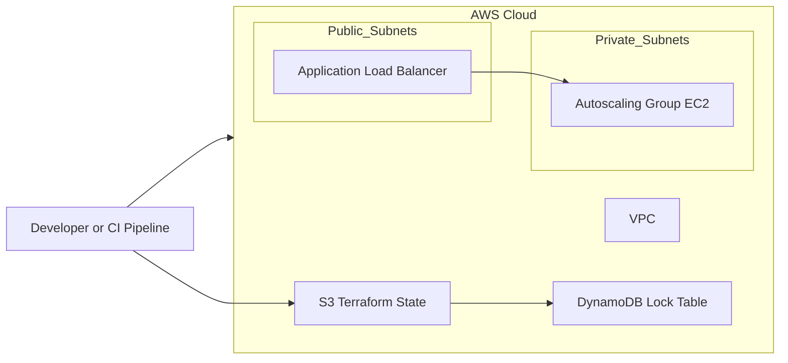

# terraform-infra-aws

Terraform modules and environment configs to provision a VPC, Auto Scaling EC2 group and an Application Load Balancer in AWS. Remote state is stored in S3 with DynamoDB locking.

## Contents

- `modules/` - reusable Terraform modules (vpc, asg, alb)
- `envs/dev` - environment config (dev)
- `envs/prod` - production config (example)
- `.github/workflows/terraform.yml` - CI pipeline (format -> validate -> plan -> apply)

## Prerequisites

- AWS account with permissions to create VPC/EC2/ALB/S3/DynamoDB/IAM
- `aws` CLI configured
- `terraform` v1.4+ locally (for manual runs)
- GitHub repo with secrets (or configure OIDC)

## Quick start (dev)

1. Bootstrap remote backend:

   ```bash
   ./scripts/bootstrap-backend.sh <bucket-name> <ddb-table> us-east-1

Ensure the S3 bucket is private and encrypted.

- export AWS_ACCESS_KEY_ID=...
- export AWS_SECRET_ACCESS_KEY=...
- export AWS_REGION=us-east-1

terraform init -backend-config="bucket=<bucket-name>" -backend-config="dynamodb_table=<ddb-table>" -backend-config="region=us-east-1"
terraform plan
terraform apply

Check outputs in the console for ALB DNS name.

## CI/CD

- On PR: runs terraform fmt check, tflint, tfsec, and terraform plan.
- On merge to main: runs terraform apply (configure environment protections for manual approval).

## Improvements

- Replace CI creds with GitHub OIDC.
- Register targets with ALB via target group attachments and not aws_instances lookup (more robust).
- Use Launch Template with cloud-init or user-data to pull latest artifcats from S3/AMI.
- Use Terragrunt for multi-environment orchestration (optional).

---

## Architecture Diagram (Mermaid)

